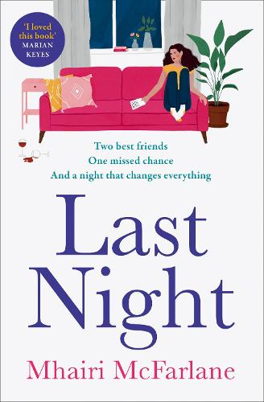
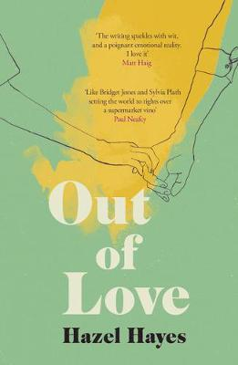
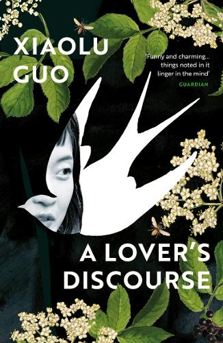

## **Typefaces and the characteristics of contemporary romance novels.**

Searching for the perfect love story, we encounter our ‘love at first sight’ - the book cover. Often to reflect the delicate nature of the plot, variations of thin serif typefaces are used (but not always). In the first example ‘Last Night’ by Mhairi McFarlane, the typeface uses serif characters with a high contrast, regular width and a tall x-height. The choice of this particular typeface communicates feminine and romantic ideas, which appropriately suit the book’s genre. The reading demographic for contemporary romance novel readers is composed of a high ratio of young women, to around 20% men; reflective of its readership it is suitable for books to be illustrated with thin and elegant typefaces, which reminisce the era of romanticism and vivid feminine imagery. The book cover presents itself as lighthearted, the fine lines of the fluctuant stressing of the characters create an eye-pleasing appearance and may encourage connotations of effortless grace and candid intimacy.

Moreover, we can see a trend in the usage of serif typefaces for romance books as the second example shares some of the same characteristics. ‘Out of Love’ by Hazel Hayes uses a rather bulky serif typeface, compared to the dainty and tall characters used for the cover of ‘Last Night’. The typeface has a high contrast and weight, the first example is styled with rounded serifs whereas the second has the appearance of straight and sharp serifs. The edged serifs juxtaposes the previous example, although the title communicates the theme of love, the appearance of the text can be viewed as intense and heavy. The density of the characters might be symbolic of the book’s writing style, suggesting the flow of the story. The author can communicate ideas and use typography as an extension of storytelling, engraving the plot into the typeface used on the book’s cover. 

Xiaolu Guo’s ‘A Lover’s Discourse’ has a polarising appearance compared to the other romance novels, the cover acquires the fundamental characteristics of romanticism, similar to ‘Last Night’ and ‘Out of Love’. The cover elevates and highlights nature’s beauty, some of the characters are partially hidden behind flower leaves but remain legible. Moreover, the typeface appears to be monospaced, creating a refined visual which empathises the contemporary appearance of various elements displayed on the book cover. One may view Guo’s book as modern and sophisticated, accompanied with the additional implication that the third example may resemble an academic text or be presented alongside self-help books; due to the solid sans serif typeface which deprives the cover of the graceful and fluid visuals that put forward the impression of femininity and fragile intimacy, an element visible in the other romance novels previously mentioned.

The complex versatility of typefaces, visible on contemporary romance novels illustrates how a range of styles and characteristics can be recognisable, as well as suggestive of a conjugative theme. A collection of similarities and differences, the characteristics of typefaces used on the book covers composed of countless aspects, like the ones deconstructed in this article, transform the reader’s perception of the story and they may also influence the entire reading experience. Like the many elements which vividly decorate the front cover of books or the ‘face’ of the story, the stylistic typeface centers our attention and communicates the tone and notions of the plot performing as an extension of the story.