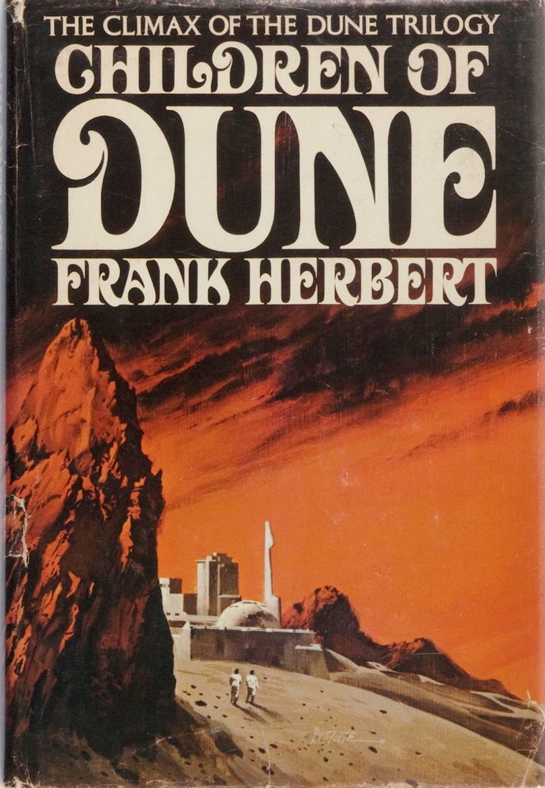
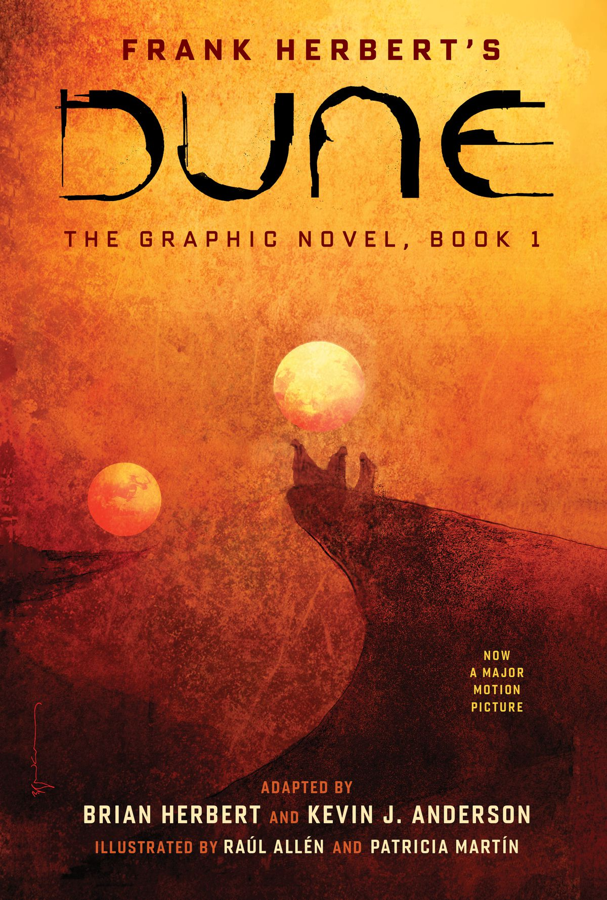

## Taking a closer look at Frank Herbert’s *Dune* series, we are taken across time to see how the typeface used for the title has changed and transformed along with the sci-fi genre.

To see the transformation of typography over time we can start by looking at the third book of Herbert’s six novel series of *Dune - ‘Children of Dune*, first published a decade after the first novel of the sci-fi series. The title on this book cover is presented using a decorative serif typeface, the medium contrast creates an organic flow of the text along with the swashes which resemble the pattern seen in the sky of the background image. The swashes could also create connotations to sand moving in the wind, this too is visible in the background image. This particular characteristic ties all the other elements of the design together, implementing a sense of cohesion to the overall design of the book cover. Although the first book in the series does not share the futuristic visual, as many of the cover designs depict what resembles a forest landscape, the typeface used for the title could possibly cause readers to form associations with elements and patterns found in nature, similarly to the one displayed on the cover of the third novel. The continuity of this typographical style throughout the series constructs a brand for the novels, making the books recognisable by typeface alone. Additionally, it gives the series an element of uniqueness and the novels acquire their own individual identity, this factor separates the novels from other publications on the shelf.

The series has once again gained popularity due to its recent adaptation as a motion picture, the 21st century resurgence of the series presents the novels in a completely new and contemporary style. Most of the latest designs feature a promotional sticker, typed using a standard sans serif typeface as commonly seen on other publications. The cover used as an example in this blog post (pictured below) has a very minimalistic appearance, prioritising elements such as the background image and placing the text in a lower value section of the overall design hierarchy, meaning that the focus on the text is secondary compared to other components of the book cover. This contrasts with one of the original designs for this novel, as in the previous example of the older editions the text is styled to appear prominent in comparison to the background image. This quality can reflect how the typographic design centers the viewers’ attention, older editions used an intricate and complex design implementing decorative serifs, whereas the modern cover is very minimal and unadorned by any extended strokes. The text of this modern cover is displayed using low contrast, sans serif characters, both the title and the name of the author appear monospaced. The title has an intriguing design as it is illustrated using the same character, which is then rotated to be read as different letters. This characteristic is quite distinctive in comparison to the book cover design of the novel published in 1976; it could even be argued that due to new and perhaps unfamiliar design to older readers of the series, the modern edition stands independently from former editions of the same title. 

 Frank Herbert Book Cover ")

The resurfacing of the novels has led to other adaptations, such as graphic novels. Similarly to the 2021 book cover design, other adaptations illustrate the title in a new and reimagined way. This particular adaptation by Brian Herbert and Kevin J. Anderson presents the novel using a unique typeface, specifically designed to illustrate the concept of the story by visualising parts of it and transforming them into text. This element in particular is suitable for the nature of this adaptation as it is a graphic novel, therefore, it is crucial to achieve visual understanding of what originally is conveyed using text. This design sets itself apart from the two other editions mentioned, as its function is not solely to coordinate with the other elements of the book cover design, it also tells the story through its appearance. Despite its unique nature, there are characteristics which can be recognised in this typeface; for example, the high contrast of individual characters and the possibility of the typeface being categorised as sans serif, concluding from the lack of extended strokes or lines.

Herbert’s *Dune* series has gone through many changes and transformations over the years since its first publication in the 60s; some elements have been altered, whereas others have remained the same. All reconstructions of the design for this science fiction novel have aimed to best convey its story, while simultaneously reflecting the market the series was being published in at the time. In the decades the series has been in print, its readers have seen a wide range of cover designs, all quite possibly offering a distinct reading experience as an effect of the redefined portrayal of the story as displayed on the book cover.